# Scully docs navlist & redesign <!-- omit in toc -->
...or "I accidentally rewrote all your docs"

Demo: https://boring-benz-f40cbd.netlify.app/

- [Explanation](#explanation)
- [Motivation](#motivation)
- [Benefits](#benefits)
- [Examples](#examples)
    - [Nested link structure](#nested-link-structure)
    - [Parent & child positions](#parent--child-positions)
    - [Independent Scrollbars](#independent-scrollbars)
    - [Updated styles](#updated-styles)
    - [Table of contents](#table-of-contents)
    - [Pre-styled elements](#pre-styled-elements)
    - [Clearer syntax highlighting](#clearer-syntax-highlighting)
- [Changes](#changes)
    - [Breaking content out into separate files](#breaking-content-out-into-separate-files)
    - [Create a blog](#create-a-blog)
    - [Introduction / Getting Started / Top Navigation](#introduction--getting-started--top-navigation)
    - [Page heading / TOC structures](#page-heading--toc-structures)
    - [Home page](#home-page)
- [Issues](#issues)
  - [Bugs](#bugs)
    - [ScullyRoutesService observable replaces same-name pages in different folders](#scullyroutesservice-observable-replaces-same-name-pages-in-different-folders)
  - [Incomplete](#incomplete)
    - [Responsive styles](#responsive-styles)
    - [TOC fragment links don't work](#toc-fragment-links-dont-work)
    - [Linking back to the repo](#linking-back-to-the-repo)
    - [Utility Methods, etc](#utility-methods-etc)
    - [`<scully-content>` "flash" (?)](#scully-content-flash-)
    - [Semi-squirrely code](#semi-squirrely-code)
  - [Limitations](#limitations)
- [Notes](#notes)

## Explanation

This project started as building a navigation component which could organize itself hierarchically, based on a nested `.md` / blog / folder structure, derived from `scully.available$`.

But if we're going to build the nav for the hierarchy, we should probably reassess the actual conceptual hierarchies the links will reflect.

And if we're going to reassess all the links, we may as well tighten up the content, consolidate duplicate information, and make it easier to linearly navigate the docs.

But if we're going to reassess and rewrite the content, and build a new nav component, may as well tighten the styles of the rest of the docs to match the new component.

And if we're going to tackle the styles of the docs, may as well consolidate the home page to match as well.

So here we are.. "Honey, I rewrote your docs".

## Motivation

- Scully is exciting, but I found it challenging to follow the current docs.
- The left navigation is cluttered and doesn't reflect hierarchical relationships.
- A lot of duplicated content on different pages with different structures.
- Very long pages with many steps and headings, probably better suited to be broken down into multiple, smaller, more easily digestible files / pages.

I found using the Scully docs was not as linear a process as I desired, and I had to become quite familiar with the whole site, and headings nested somewhere within the pages of the site, to get a grip on how everything worked and what I was missing.

But once familiar, I could conceptualize hierarchical groupings of pages and themes, and ended up designing something like "what I wished the docs looked like when I was trying to figure them out".

## Benefits

I hope this **redesign** and **navigation list component** can be useful for the Scully docs, and help others navigate them more smoothly / clearly in the future. These are the benefits I think it can provide:

- The hierarchical, nested link structure can make it easier to isolate steps or subjects into their own pages without cluttering the "global" / "root" nav list.  
  These nested link lists can be open and closed. They open automatically if a nested link is navigated to.  
[Example](#nested-link-structure)
- Clearer to see which elements / pages need more documentation.
  - eg. Some plugins have complete explanations (json, router), while others have virtually none (md, ignored).  
  Seeing each plugin's page, complete or not, in the navigational hierarchy can more clearly show which ones need more work.
  - "Blank-ish" pages could even function as "doc addition issues", which may invite other users to contribute  open source page completions to match more complete sibling page structures, instead of grouping many subjects in one page. 
- The navigation structure can also accommodate parent and child positions based on `.md` metadata.  
[Example](#parent--child-positions)
- Navigation scrolling and doc page scrolling are independent of each other. Scroll through docs without losing your place in the visual link hierarchy.  
[Example](#independent-scrollbars)
- Updated doc styling, customized for each heading, improves readablility / _"skim-ability"_.  
[Example](#updated-styles)
- Table of contents can be easily generated inline, and retains any text formatting of corresponding link headings.  
[Example](#table-of-contents)
- Custom styled elements can be included with a simple syntax like `<a class="next" href="#">`, to deliver clearer intention of richer-styled navigation elements, leaving minimal steps for the writer.  
[Example](#pre-styled-elements)
  - In addition, `"prev"` / `"next"` type buttons can help users avoid navigational confusion by giving them a "defined-by-Scully" place to go next, and, if a user finds themselves in the middle of a series of steps, which page behaves as a prerequisite for the current one.
- `<pre>` code blocks are simpler, with tighter margins and a custom, but simple / skimmable, syntax highlighting theme.  
[Example](#clearer-syntax-highlighting)

## Examples

#### Nested link structure
Hide away non-relevant links, and be more explicit with visible link groups.

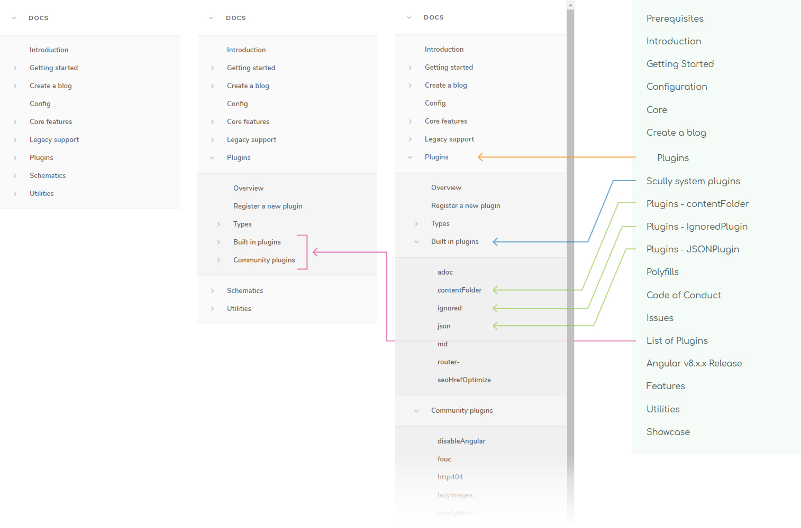

#### Parent & child positions
The variable names aren't necessarily final / important, but this demonstrates that __page__ and __page container heading__ `positions` can be mixed and defined together.

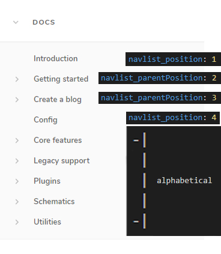

#### Independent Scrollbars
Navigation and doc content can be scrolled independently of each other.

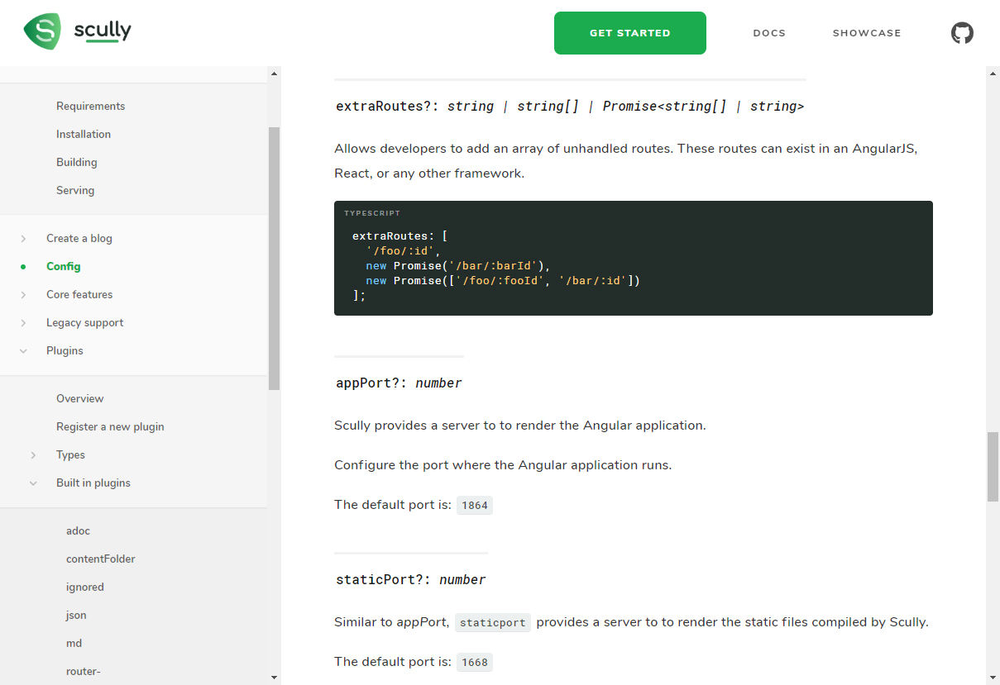

#### Updated styles
Headings contain more data, in text _and_ formatting, and have clearer separation between values.  
Typeface is more versatile, and things like inline `<code>` blocks and links are more easily skimmable.

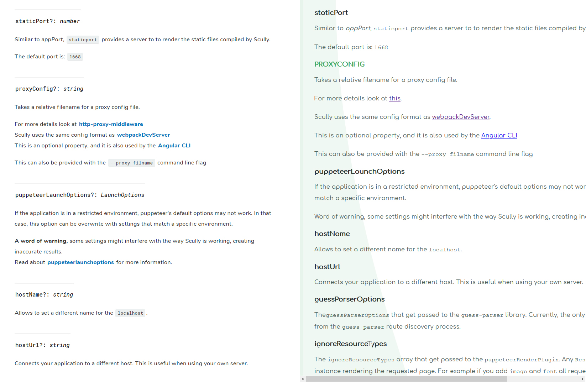

#### Table of contents
Although a Scully `toc` plugin already exists, it cannot translate heading styles to the list.  
By using an empty `

` directly before a list, this version can include `<code>` and other _`_formatting_`_ in its `li a` styles.

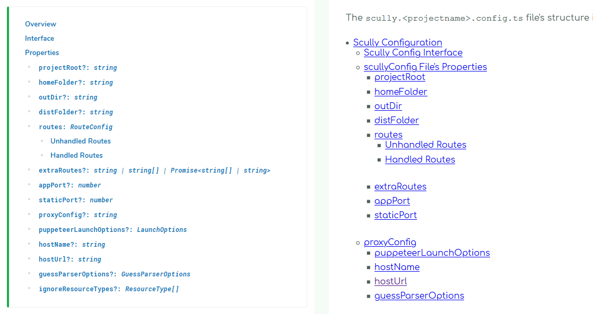

#### Pre-styled elements
For some elements, CSS alone handles the button content, so you only need to specify the link type/style and url.  
Each element can also obviously accept an explicit button string value as well.

For elements like `"prev"` and `"next"`, they will maintain their left/right positioning regardless of if accompanied by a sibling or not.  
ie. If lacking a `"prev"` button, the `"next"` button will still hug the right.

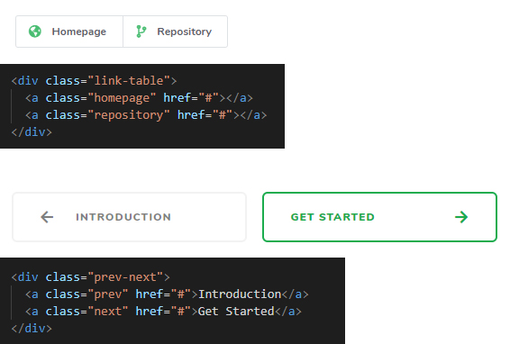

#### Clearer syntax highlighting
More contrast between comments and code, and between definitions and variables.  
Removed seemingly redundant top margins.  
**Also note** the new `<pre>` has its own horizontal scrollbar if required, whereas in the current doc version the entire page has to horizontally scroll.  

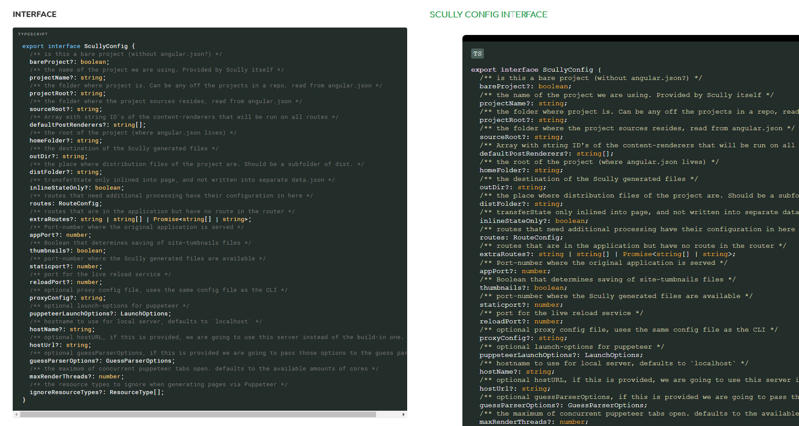

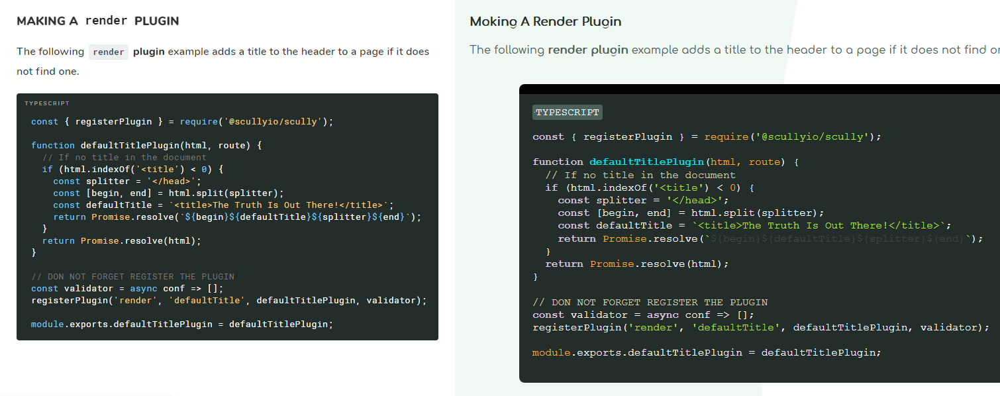

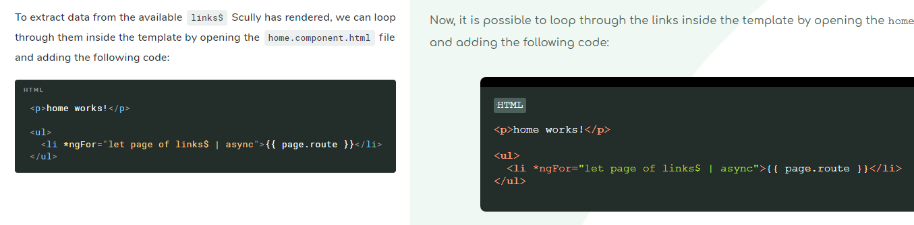

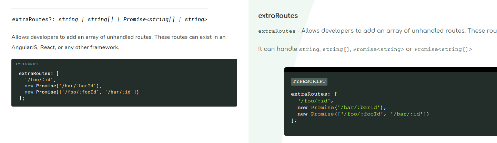

## Changes

If desired, I can go through each page and the differences between it and its existing counterpart, but for now, for brevity, I'll just touch on some key restructurings.

#### Breaking content out into separate files
- The `Plugins` heading is a good example..
  - The current docs have one Plugins page which touches on registering plugins, what they are, the types of plugins and their differences.
  - The link `List of Plugins` leads to a page called `Recommended Plugins`, listing brief examples of built-in plugins, some of which have their own pages in the nav..
  - ..alongside community plugins, which aren't visible anywhere else other than at the bottom of `Recommended / List of Plugins`
- The new design aims to consolidate similar concepts, reduce confusion, and deliver the user consistency and predictability in navigation.  
For example:
  - The single pages for `contentFolder`, `json`, etc are merged with their brief headings referenced in other pages, and grouped in a `Built-in Plugins` heading.
  - These plugins' new page structures attempt to emulate the structures of `Community Plugin` readme structures, which makes the hierarchy of plugins and how to use them more congruent, predictable and simple to follow.
- This general process was repeated on other similar page structures with the goal of streamlining concepts and minimizing information "firehoses". 

#### Create a blog
- Content from `Create a blog` and `Getting Started` shared pieces of their processes.
- The goal, again, was to extract out bite-sized chunks of information, but in this case also lay pages out linearly, with clear steps to follow, instead of similar, technical information shared across multiple pages.

#### Introduction / Getting Started / Top Navigation
- The current `Introduction` page is pretty small, and contains content like `Support` and `Contributing` information which can be extracted into their own pages, alonside a partial list of some existing links, already present in the left navigation.
- The goal here was to, from the first `Introduction` page, lead the reader explicitly through a defined series of easily conquerable steps, instead of giving the user more options to figure out how to make sense of on their own.
- So the `Introduction`, `Getting Started` and `Prerequisite` pages were all repurposed and simplified into smaller steps, with clear indicators of where a user is in the sequence.
- This relates directly with the main/top navigation in that some links became more redundant.
  - "Learn" and "Docs" were sort of leading to the same place. 
  - "Features" was already extracted out into individual links / link headings.
  - As a result, the top navigation was simplified to:
    - **One** "call to action" button "Getting Started"
    - **One** link to the "Docs" themselves, starting the user at the linear beginning.
    - "Showcase" is unique and useful enough to remain.
  - ..without adding confusion or taking away functionality. 

#### Page heading / TOC structures
- I tried to find a common page structure which many pages can share, decreasing the complexity of the overall site experience, and again, increasing predictability for the user.
- It took the form of something like:
  - **Overview**
  - **Installation**
  - **Usage**
  - **Interface**
- Some pages don't have an **installation** heading, some don't need an **interface**.
- But the goal was to have a consistent, hierarchical list of headings / blocks, which individual pages can remove and add where appropriate, to keep the sub-sub-structures of the site as linearly similar and predictable as possible.
  

#### Home page
- More consolidation of similar phrases, and simplification of possible directions a user could take.
- The "features" section resizes to its content / doesn't cut off its description text.
- "Guides" and "Create a blog" buttons seem to be broken links on the current site. These were fixed here too.
- Footer hopefully has more contrast and is more readable.
- "Custom" icon for "Best of both worlds", attempting to indicate the fact that Scully solves the issue of SEO for Angular.

## Issues

### Bugs

#### ScullyRoutesService observable replaces same-name pages in different folders
If you check out the live site, you may notice some page links have `-` or `--` after their names.

There seemed to be a problem with the `ScullyRoutesService.available$` observable where pages with the same filename, _but_ in different directories, would get replaced with the most recent page of that name.

However, the actual pages seem to be built and navigable. The corresponding observable entries are the only things which seem to be affected.

For example, a folder structure like:

Plugins  
|-- Overview  
Utilities  
|-- Overview  

..both `../overview` pages will be created in their respective directories in `dist/static`, but the observable will only show the "Utilities" entry, seemingly _in the place of_ where the "Plugins" entry should have been.

Changing each "Overview" page file name to anything different (ie. adding a `--` at the end of the filename) fixes the problem.

This is what leads me to believe it's something like an object merge key replacement issue or something.  
That's as far as I've looked into it. Just logging it's existence here.

### Incomplete

There are still additional pieces I intend to include:

#### Responsive styles
The layout is not ideal for smaller devices at the moment.  
However, many parts are already responsive by default, and it won't be a massive project to extend out this functionality.

#### TOC fragment links don't work
Sander mentioned a fix for this but I simply haven't implemented it here yet.

#### Linking back to the repo
There are `View in Repository` buttons for some pages like `TransferStateService`, `http404`, etc. but some pages which should contain similar links, don't, like `fileHandler`, `routeDiscoveryDone`, etc.

#### Utility Methods, etc
The `Core` page references the 2 "Utility Methods", `isScullyRunning()` and `isScullyGenerated()`.  
However, finding their definintions in the repo reveals more methods like `fetchHttp`, etc.

Not sure if these extra methods are purposeful omissions, or if this section is simply incomplete.

#### `<scully-content>` "flash" (?)
I don't think this is a `TransferStateService` issue because the only affected element is the `<scully-content>` page, but there is a "flash" when navigating to another page.  
The current docs site doesn't have this issue.  
I'm assuming it's a plugin I missed or something.. I'm obviously missing something here.

#### Semi-squirrely code
The code is not really that squirrely, but it's squirrely enough to want to refine it more before sharing.  
It will obvisouly be as crisp and modular as possible, with more tests, in the future.

### Limitations

The **navigation list component** is built from a collective route structure created by Scully.  
This means route folder names can be represented as nav container group headings.

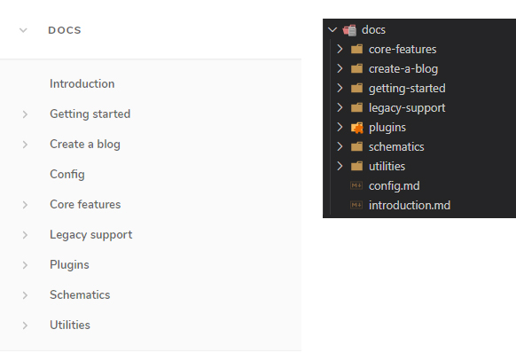

Each link heading can be customized with properties like `position` and `textFormat`, which are defined in each page's `.md` metadata.

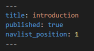

But this means that the only navigation elements which can be customized, _cannot_ be folder name / directory / group headings because folders obviously can't hold variables like files can.

So as a solution, each link has the ability to "assume the role" of its parent container heading with `navlist_parentIndex: true`, which tells the **nav list component** that this page will function as its parent's source of customization.

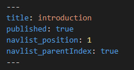

From here, instead of simply opening a group's children upon clicking a heading, the heading can now function as a link to an actual page, with customized ordering and formatting just like a page.

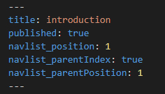

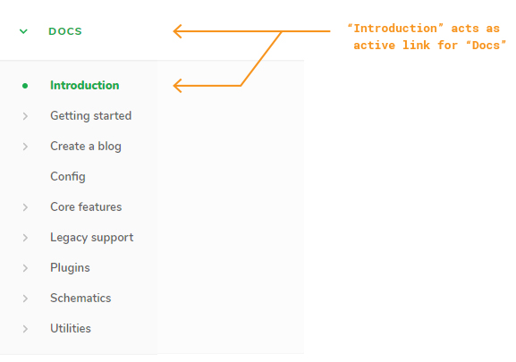

This page can be hidden in the **nav list** as well to avoid unecessary clutter.

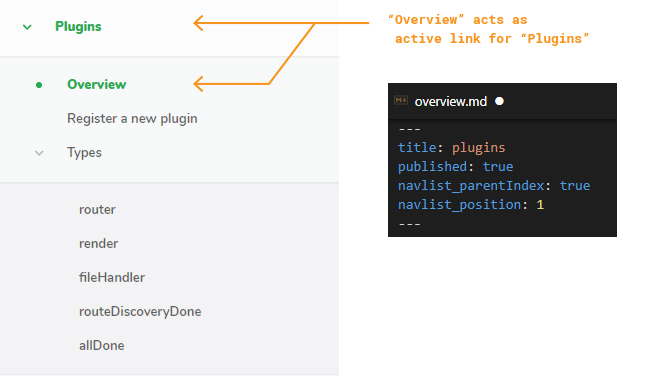

**So knowing this, the limitation becomes:**  
If a folder / heading doesn't have a child page acting as its customization vehicle, it will simply be positioned alphabetically and will not be further customizable.

## Notes

So, in an attempt to improve the current Scully Doc workflow and reduce firehosing users with information, I've now firehosed you with information.

There are loads of other points I could touch on, but they're more or less just variations on everything already stated. This was all intended to be constructive and helpful.

The code is a bit squirrely at the moment so I'm not sharing the repo itself right now, just wanted to get a proof-of-concept across to hopefully offer some improvements for constructing and maintaining documentation going forward.

I appreciate your time if you've made it this far.

don